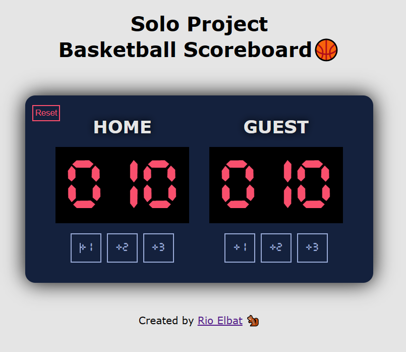

# Basketball Scoreboard

<p align="center">
  
</p>

## Description

This is a simple project to learn an interactive website with Javascript. I built this with only HTML, CSS and Javascript without a framework.

### Features

-   Add score for Guest and Home with +1, +2 & +3 buttons
-   Reset button

## How to run it

1. Clone it with this command on your terminal.

```
git clone https://github.com/rioelbat/basketball-scoreboard.git
```

2. Open `basketball-scoreboard`folder
3. Run a simple http server with Python or Node

Python

```
python -m SimpleHTTPServer 8000
```

Python3

```
python3 -m http.server 8000
```

Node

```
npx http-server -p 8000
```
